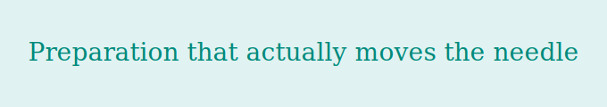

> AI-powered interview preparation agent — built by a product manager, for product managers.


Cara Coach is a conversational AI agent that simulates real job interviews and gives structured, personalised feedback on your answers.

You paste a job description and your CV. Cara parses your experience, generates questions grounded in your actual projects, and gives you feedback in a sandwich format: **what worked → what to improve → score out of 10**.

It runs on Telegram (your phone, any time) and has a web dashboard for tracking progress over time.


I was preparing for senior AI-strategy interviews and couldn't find a tool that gave honest, structured feedback — not just generic encouragement. And nothing personalised questions to *my* experience.

So I built one. It also happens to demonstrate exactly the skills I'm interviewing for: AI agent design, conversation architecture, product thinking, and Python development.


**Step 1 — Setup (web dashboard)**
Upload your CV and the job description. The system parses your CV into a structured profile: projects, roles, team sizes, outcomes, domain expertise. This becomes the foundation for everything that follows.

**Step 2 — Practice (Telegram bot)**
Start a session. Cara asks you interview questions — not generic ones, but questions grounded in your actual experience. For example:

> *"You led a team of 110 at BT Group — how did you manage transparent communication at that scale?"*

**Step 3 — Review (web dashboard)**
After each session, review your scores across four dimensions. Export the transcript. Analyse patterns. Come back and go again.


**Smart button logic: Details → Ideal Answer → Retry**

Buttons appear in sequence and hide after use — by design.

- **Details** appears first: gives hints and directional feedback before revealing the answer. The goal is to make the user think, not copy.
- **Ideal Answer** appears only after Details: shows a model answer built from the user's *own projects and experience* — not a generic template. If the user's CV doesn't contain a direct example, the system infers the best-fit project based on secondary signals (industry, team size, role, outcomes).
- **Retry** — after reading feedback, the user can re-record their answer immediately, while the insight is fresh. Retry count is tracked separately so it doesn't inflate the base score. Working on mistakes while memory is hot is how learning actually sticks.
- Buttons reset on the next question — a clean slate every time.

**Auto-generated `.md` transcript after every session**

Format chosen deliberately: `.md` is lightweight, readable on a large monitor for end-of-day review, and — critically — it's a direct input for the next step. Feed the transcript to a chat model, ask it to identify patterns and the 80/20 of recurring mistakes. PDF would waste tokens. `.md` is enough.


**Four-dimension scoring: Soft / Hard / Behavioural / Executive Language**

Not one overall score — four separate dimensions, because they develop at different rates and require different interventions:

- **Hard skills** — domain knowledge. Fastest to improve.
- **Soft skills** — communication, empathy, stakeholder management. Takes longer, requires deliberate practice.
- **Behavioural (STAR format)** — a separate skill from knowing the answer. Many strong candidates fail here simply because they can't structure a story under pressure.
- **Executive Language** — how you sound, independent of what you say. Added after recognising this was a missing dimension in all existing tools.

**Executive Language Score — 6 parameters**

Evaluated on every question, regardless of category:

| Parameter | Logic |
|---|---|
| Top-Down Structure | Main point first, details after. Burying the conclusion is penalised. |
| Hedging Density | Frequency of uncertainty markers (*I think, maybe, I guess, hopefully*) relative to answer length. |
| Apology Language Density | Frequency of apology phrases (*sorry if this is long, I hope that makes sense*) relative to answer length. |
| Result Presence | Is there a result — qualitative or quantitative? Applied only when the question implies one. |
| Professional Vocabulary | Domain-appropriate language, not layperson explanation. |
| Pattern & Framework Thinking | Does the answer reflect a method, or just retell one case? Applied only when the question is about process or approach. |

Feedback delivered in the **Details block** — tone adapted to session mode (MIRROR: direct / COACH: warmer). Ideal Answer is not touched — it's already written at the right executive level and serves as a live example.

**Session table with Export**

Columns: Date · Overall · Soft · Hard · Behavioural · Exec Language · Retried · Export

- **Retried** shows real retry count per session — separate from base scores
- **Export** downloads the `.md` transcript for that session
- **Date range export** — download all sessions in a period as one combined file, ready for pattern analysis

**Vacancy management: open / close / reopen**

Closing a vacancy does not delete session history. All previous sessions are preserved and statistics accumulate when the vacancy is reopened. Because job searches are non-linear — you pause, you revisit, you continue.


**Smart cache invalidation**

Discovered during first testing: re-parsing the CV and JD on every session was burning tokens on static data. CV and job description don't change between sessions — only the answers do. After measuring token consumption and restructuring the cache, token usage dropped by **85%**. Cache now invalidates only when the CV or JD actually changes.


## Tech stack


| Layer | Tech |
|---|---|
| Language | Python 3.11 |
| AI | Claude API (Anthropic) |
| Bot | python-telegram-bot |
| Web | Flask + HTML/CSS |
| Storage | SQLite |
| Export | Markdown (.md) |


```bash
git clone https://github.com/YOUR_USERNAME/cara-coach
cd cara-coach
pip install -r requirements.txt

# Add your keys to .env
ANTHROPIC_API_KEY=your_key
TELEGRAM_BOT_TOKEN=your_token

python bot.py        # Telegram bot
python app.py        # Web dashboard → localhost:5000
```


```
cara-coach/
├── bot.py              # Telegram bot logic
├── app.py              # Flask web app
├── agent.py            # Claude API integration
├── db.py               # SQLite operations
├── templates/          # Web dashboard HTML
├── sessions/           # Auto-saved .md transcripts
└── settings.json       # Vacancy config & status
```


Built as part of a structured self-study programme in AI agent development.
Product brief, state diagram, edge cases document, and system prompt architecture available on request.


Senior BA/PM with 20+ years in enterprise (BT Group, Primark, Janssen, AIB, Henry Schein).
Currently focused on AI agent strategy and agentic product design.

[LinkedIn →](https://www.linkedin.com/in/elena-goriachikova-4a6b8b4/)


